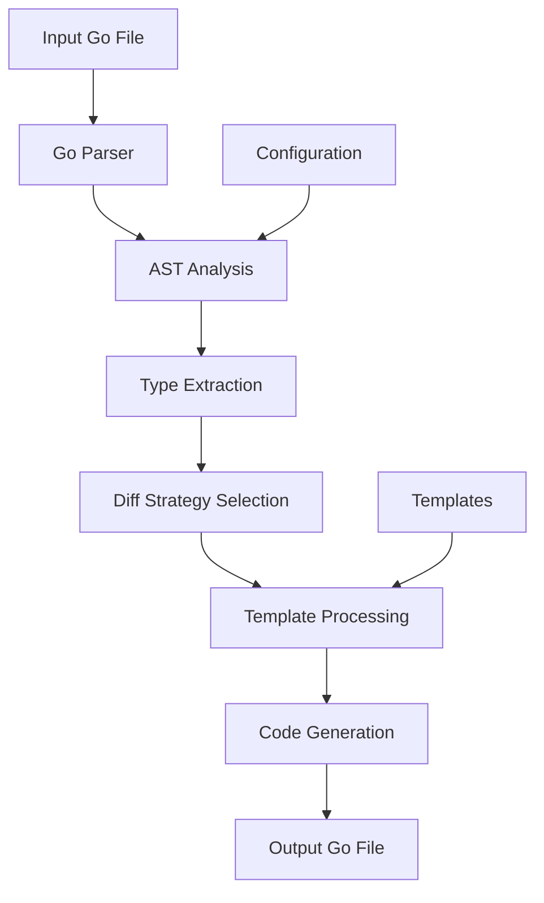

# gostaticstructdiff Developer Guide

## Architecture Overview

`gostaticstructdiff` is a Go code generation tool built using Go's standard library packages for parsing, analyzing, and generating Go source code. The tool follows a pipeline architecture with distinct stages for processing.

### System Architecture



### Core Components

1. **Parser Module**: Uses `go/parser` to parse Go source files into AST
2. **Analyzer Module**: Traverses AST to find structs with `structtomap` tags
3. **Type System**: Maps Go types to diff generation strategies
4. **Template Engine**: Uses Go's `text/template` for code generation
5. **Generator Module**: Orchestrates the generation pipeline

## Project Structure

```
gostaticstructdiff/
├── cmd/
│   └── gostaticstructdiff/     # CLI entry point
├── internal/
│   ├── parser/                 # AST parsing and analysis
│   ├── generator/              # Code generation logic
│   ├── types/                  # Type system and strategies
│   └── templates/              # Go templates for code generation
├── examples/                   # Example code and generated output
├── doc/                       # Documentation
├── go.mod                     # Go module definition
└── go.sum                     # Dependency checksums
```

### Key Packages

- **`github.com/andreykyz/gostaticstructdiff/cmd/gostaticstructdiff`**: CLI interface
- **`github.com/andreykyz/gostaticstructdiff/internal/parser`**: Parses Go files, extracts struct information
- **`github.com/andreykyz/gostaticstructdiff/internal/generator`**: Generates diff structs and patch functions
- **`github.com/andreykyz/gostaticstructdiff/internal/types`**: Type system and diff strategies
- **`github.com/andreykyz/gostaticstructdiff/internal/templates`**: Template definitions

## Development Setup

### Prerequisites

- Go 1.26 or later
- Git for version control
- Basic understanding of Go AST and code generation

### Getting Started

1. **Clone the repository**:

```bash
git clone https://github.com/andreykyz/gostaticstructdiff
cd gostaticstructdiff
```

2. **Install dependencies**:

```bash
go mod download
```

3. **Build the tool**:

```bash
go build -o gostaticstructdiff ./cmd/gostaticstructdiff
```

4. **Run tests**:

```bash
go test ./...
```

### Development Workflow

1. **Make changes** to the source code
2. **Run tests** to ensure functionality
3. **Update examples** if changing generation patterns
4. **Regenerate test outputs** if templates changed
5. **Run integration tests** with example files

### Code Style

- Follow standard Go conventions
- Use `gofmt` for formatting
- Run `go vet` and `staticcheck` for linting
- Write comprehensive tests for new features

## Code Generation Pipeline

### Phase 1: Parsing

The parser uses `go/parser.ParseFile` to create an AST, then traverses it to find type specifications:

```go
// Simplified parser logic
fset := token.NewFileSet()
node, err := parser.ParseFile(fset, filename, nil, parser.ParseComments)
if err != nil {
    return nil, err
}

// Find all struct type declarations
ast.Inspect(node, func(n ast.Node) bool {
    if typeSpec, ok := n.(*ast.TypeSpec); ok {
        if structType, ok := typeSpec.Type.(*ast.StructType); ok {
            // Process struct
        }
    }
    return true
})
```

### Phase 2: Type Analysis

For each struct field, the analyzer:
1. Extracts field name and type
2. Checks for `structtomap` tags
3. Determines the appropriate diff strategy
4. Handles nested types recursively

### Phase 3: Strategy Selection

Based on field type, different diff strategies are applied:

| Type Category | Strategy | Template |
|---------------|----------|----------|
| Basic types | ScalarDiff | `scalar_diff.tmpl` |
| Pointer types | PointerDiff | `pointer_diff.tmpl` |
| Slice types | SliceDiff | `slice_diff.tmpl` |
| Map types | MapDiff | `map_diff.tmpl` |
| Struct types | StructDiff | `struct_diff.tmpl` |

### Phase 4: Template Processing

Templates use Go's `text/template` with custom functions for code generation:

```go
// Template for scalar fields
{{define "scalar_field"}}
{{.FieldName}} struct {
    Value {{.FieldType}}
    Set   bool
}
{{end}}
```

### Phase 5: Code Generation

The generator writes the processed templates to the output file, ensuring proper imports, package declaration, and formatting.

## Extending the Tool

### Adding New Field Types

To support a new field type (e.g., `complex128`):

1. **Add type recognition** in `internal/types/analyzer.go`:

```go
func isBasicType(t string) bool {
    basicTypes := map[string]bool{
        "int": true, "string": true, "bool": true,
        "float64": true, "float32": true,
        "complex128": true, // New type
    }
    return basicTypes[t]
}
```

2. **Create or update template** for the type
3. **Add tests** for the new type
4. **Update documentation**

### Customizing Diff Strategies

Diff strategies are defined in `internal/types/strategies.go`. To create a custom strategy:

```go
type CustomDiffStrategy struct {
    FieldType string
}

func (s *CustomDiffStrategy) GenerateField(field Field) (string, error) {
    // Custom generation logic
    return fmt.Sprintf(`%s struct {
        CustomValue %s
        Modified    bool
    }`, field.Name, s.FieldType), nil
}
```

### Adding New Templates

Templates are stored in `internal/templates/`. To add a new template:

1. Create a new `.tmpl` file
2. Register it in `internal/generator/template_registry.go`
3. Update the strategy to use the new template

## Testing Strategy

### Unit Tests

Each package has comprehensive unit tests:

```bash
# Run tests for a specific package
go test ./internal/parser

# Run tests with coverage
go test -cover ./...
```

### Integration Tests

Integration tests verify the end-to-end generation pipeline:

```bash
# Run integration tests
go test -tags=integration ./tests
```

### Golden File Tests

Golden file tests compare generated output with expected output:

```go
func TestUserStructGeneration(t *testing.T) {
    generator := NewGenerator()
    output, err := generator.Generate("testdata/user.go", "User")
    if err != nil {
        t.Fatal(err)
    }
    
    golden := readGoldenFile("testdata/user_diff.golden.go")
    if output != golden {
        t.Errorf("Generated code doesn't match golden file")
    }
}
```

### Example-Based Tests

The `examples/` directory serves as both documentation and test cases:

```bash
# Regenerate examples and verify they match
go run ./cmd/gostaticstructdiff -input examples/models/user.go -output /tmp/user_diff.go
diff /tmp/user_diff.go examples/models/user_diff.go
```

## Performance Considerations

### AST Parsing

- Parsing is O(n) where n is file size
- Cache parsed files when processing multiple files
- Consider incremental parsing for large codebases

### Code Generation

- Template execution is fast for typical structs
- Large structs with deep nesting may require optimization
- Consider parallel generation for multiple structs

### Memory Usage

- AST can be memory-intensive for large files
- Release AST nodes after processing
- Use streaming generation for very large outputs

## Contributing Guidelines

### Pull Request Process

1. **Fork the repository**
2. **Create a feature branch**:
   ```bash
   git checkout -b feature/your-feature
   ```
3. **Make your changes**
4. **Add tests** for new functionality
5. **Update documentation**
6. **Ensure tests pass**:
   ```bash
   go test ./...
   ```
7. **Submit a pull request**

### Code Review Checklist

- [ ] Code follows Go conventions
- [ ] Tests are comprehensive
- [ ] Documentation is updated
- [ ] Examples are updated if needed
- [ ] No breaking changes without discussion

### Release Process

1. **Update version** in `cmd/gostaticstructdiff/version.go`
2. **Update CHANGELOG.md** with changes
3. **Create a release tag**:
   ```bash
   git tag v1.2.3
   git push origin v1.2.3
   ```
4. **Create GitHub release** with release notes
5. **Update documentation** if needed

## Debugging

### Verbose Mode

Use the `-verbose` flag to see detailed processing information:

```bash
gostaticstructdiff -input test.go -output test_diff.go -verbose
```

### AST Inspection

For debugging parsing issues, use Go's AST inspection tools:

```go
import (
    "go/ast"
    "go/parser"
    "go/token"
)

func debugAST(filename string) {
    fset := token.NewFileSet()
    node, _ := parser.ParseFile(fset, filename, nil, parser.AllErrors)
    ast.Print(fset, node)
}
```

### Template Debugging

To debug template issues, enable template error debugging:

```go
tmpl, err := template.New("diff").Funcs(funcMap).Parse(templateStr)
if err != nil {
    log.Printf("Template error: %v", err)
}
```

## Common Development Tasks

### Adding a New Command Flag

1. Update `cmd/gostaticstructdiff/main.go`:
   ```go
   flag.StringVar(&config.CustomFlag, "custom", "", "Custom flag description")
   ```
2. Update help text
3. Add tests for the new flag

### Supporting a New Go Version

1. Update `go.mod` to the new Go version
2. Test with the new Go version
3. Update CI configuration
4. Update documentation

### Handling Breaking Changes

1. Document the change in `CHANGELOG.md`
2. Provide migration guide if needed
3. Consider deprecation period for old behavior
4. Update examples to reflect changes

## Resources

- [Go AST Package Documentation](https://pkg.go.dev/go/ast)
- [Go Template Package](https://pkg.go.dev/text/template)
- [Go Code Generation Best Practices](https://blog.golang.org/generate)
- [Testing Go Code](https://golang.org/pkg/testing/)

## Getting Help

- Open an issue on GitHub for bugs or feature requests
- Check existing issues for similar problems
- Review the examples directory for usage patterns
- Refer to the user documentation for common questions