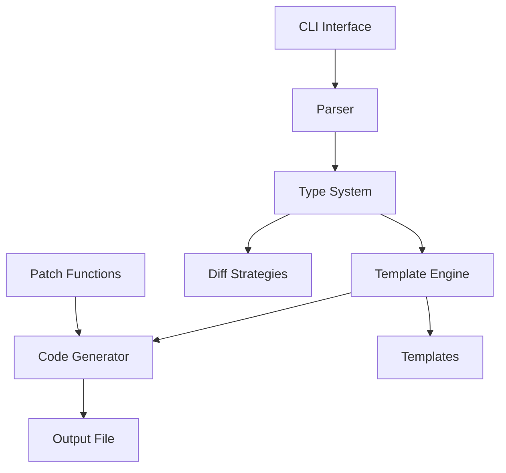

# Implementation Plan for gostaticstructdiff

## Overview

This document outlines the step-by-step implementation plan for the `gostaticstructdiff` CLI utility, which generates type-safe diff structures and patch functions from Go structs annotated with `structtomap` tags.

## Architecture

The tool follows a pipeline architecture:

```
Input Go File → Parser → Type Analysis → Template Rendering → Output Go File
```

### Component Diagram



## Implementation Phases

### Phase 1: Project Structure Setup
- Create directory structure as per Go conventions
- Set up `cmd/gostaticstructdiff/main.go` skeleton
- Create internal packages: `parser`, `generator`, `types`, `templates`
- Verify `go build` works

### Phase 2: CLI Interface
- Implement command-line argument parsing using `flag` package
- Support flags: `-input`, `-output`, `-struct`, `-verbose`, `-version`
- Add help text and error handling
- Implement file I/O operations

### Phase 3: AST Parser
- Use `go/parser` and `go/ast` to parse Go files
- Extract struct definitions with `structtomap` tags
- Parse field information: name, type, tags
- Handle nested structs recursively
- Support pointer, slice, map, and basic types

### Phase 4: Type System & Diff Strategies
- Classify field types into categories:
  - Basic types (int, string, bool, float64)
  - Pointer types (*T)
  - Slice types ([]T)
  - Map types (map[K]V)
  - Struct types (nested/imported)
- Define diff strategy for each type:
  - Basic: `struct { Value T; Set bool }`
  - Pointer: `struct { Value *T; Set bool }`
  - Slice: `struct { Value []T; Set bool }`
  - Map: `struct { Add map[K]V; Del map[K]struct{}; Set bool }`
  - Struct: recursive diff struct

### Phase 5: Template System
- Create Go templates for each component:
  - `struct_diff.tmpl`: Main struct template
  - `field_basic.tmpl`, `field_pointer.tmpl`, `field_slice.tmpl`, `field_map.tmpl`, `field_struct.tmpl`
  - `patch_func.tmpl`: Patch function template
- Ensure templates generate code matching corrected examples
- Include proper imports and package declarations

### Phase 6: Code Generator
- Integrate parser, type system, and templates
- Generate `StructNameDiff` type definitions
- Generate two patch functions per struct:
  - `StructPatch(original, new Struct) StructDiff`
  - `StructPatch(original Struct, diff StructDiff) Struct`
- Handle multiple structs in one file
- Manage imports and package dependencies

### Phase 7: Patch Function Implementation
- Implement diff computation logic for each field type
- Implement diff application logic
- Ensure round-trip property: `Patch(Patch(original, new)) == new`
- Optimize for performance (minimal allocations)

### Phase 8: Testing & Validation
- Unit tests for each component
- Integration tests with example files
- Golden file tests for regression testing
- Property-based tests for patch functions
- CLI end-to-end tests
- Performance benchmarks

### Phase 9: Documentation & Examples
- Update README with usage instructions
- Add `go:generate` directive examples
- Create additional example files
- Document limitations and known issues

## Detailed Task Breakdown

### Task 1: Project Structure Setup
1. Create `cmd/gostaticstructdiff/main.go` with basic CLI skeleton
2. Create `internal/parser/parser.go` with placeholder
3. Create `internal/generator/generator.go` with placeholder
4. Create `internal/types/` package with type definitions
5. Create `internal/templates/` directory for template files
6. Verify `go build ./cmd/gostaticstructdiff` succeeds

### Task 2: CLI Interface Implementation
1. Implement flag parsing in `main.go`
2. Add validation for required `-input` flag
3. Implement default output filename (`<input>_diff.go`)
4. Add `-struct` filter support
5. Implement verbose logging
6. Add version flag
7. Write help text

### Task 3: AST Parser Implementation
1. Create `ParseFile` function in `internal/parser/parser.go`
2. Use `go/parser.ParseFile` to get AST
3. Traverse AST to find `*ast.TypeSpec` with `*ast.StructType`
4. Filter structs with `structtomap` tags
5. Extract field information into `Field` struct
6. Handle nested structs recursively
7. Return `[]StructInfo` with all parsed data

### Task 4: Type System Design
1. Define `TypeCategory` enum (Basic, Pointer, Slice, Map, Struct)
2. Create `TypeInfo` struct with category and underlying type
3. Implement `ClassifyType` function that analyzes `ast.Expr`
4. Define `DiffStrategy` for each category
5. Create mapping from type to template name

### Task 5: Template System Creation
1. Create template files in `internal/templates/`
2. Write `struct_diff.tmpl` that iterates over fields
3. Write field-specific templates for each type category
4. Write `patch_func.tmpl` for generating patch functions
5. Add template functions for code formatting
6. Test templates with sample data

### Task 6: Code Generator Implementation
1. Create `Generate` function in `internal/generator/generator.go`
2. Accept `[]StructInfo` from parser
3. For each struct, apply appropriate templates
4. Generate imports based on used types
5. Write complete Go source code to output
6. Ensure generated code is properly formatted

### Task 7: Patch Function Implementation
1. Implement diff computation in generated code
2. For basic types: compare values, set `Set: true` if different
3. For maps: compute added/deleted entries
4. For slices: compare entire slices
5. For nested structs: call recursively
6. Implement diff application logic
7. Test with property-based tests

### Task 8: Testing Strategy
1. Unit tests for parser with various struct definitions
2. Unit tests for type classification
3. Golden tests comparing generated output with expected
4. Integration tests running tool on example files
5. Property-based tests for patch functions
6. CLI tests with different arguments
7. Performance benchmarks

### Task 9: Documentation
1. Update README.md with installation and usage
2. Add examples for common use cases
3. Document `go:generate` integration
4. Create troubleshooting guide
5. Update CHANGELOG.md

## Success Criteria

1. **Functional**:
   - Tool generates correct diff structs for all example files
   - Generated code compiles without errors
   - Patch functions work as expected
   - Round-trip property holds for all field types

2. **Usability**:
   - Clear CLI interface with helpful error messages
   - Reasonable performance (sub-second for typical structs)
   - Good documentation with examples

3. **Code Quality**:
   - Well-structured, maintainable code
   - Comprehensive test coverage (>80%)
   - Proper error handling
   - No panics in normal operation

## Risk Mitigation

1. **Complex Type Handling**: Start with basic types, gradually add support for pointers, slices, maps, and nested structs.
2. **Template Complexity**: Use simple templates initially, refactor as needed.
3. **Performance**: Profile early, optimize hot paths.
4. **Edge Cases**: Create comprehensive test suite covering edge cases.

## Timeline

The implementation will follow the phased approach outlined above. Each phase builds upon the previous, allowing for incremental validation and feedback.

## Next Steps

1. Begin with Phase 1: Project Structure Setup
2. Implement each component with test-driven development
3. Continuously validate against example files
4. Iterate based on testing results

## References

- Example files in `examples/` directory
- Go standard library: `go/ast`, `go/parser`, `text/template`
- Similar tools: `stringer`, `easyjson`, `go-swagger`